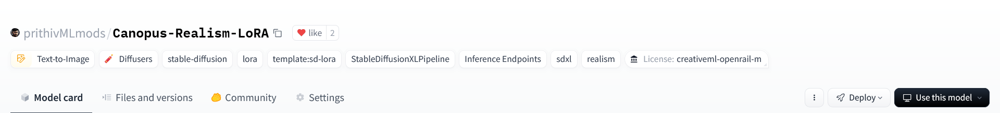
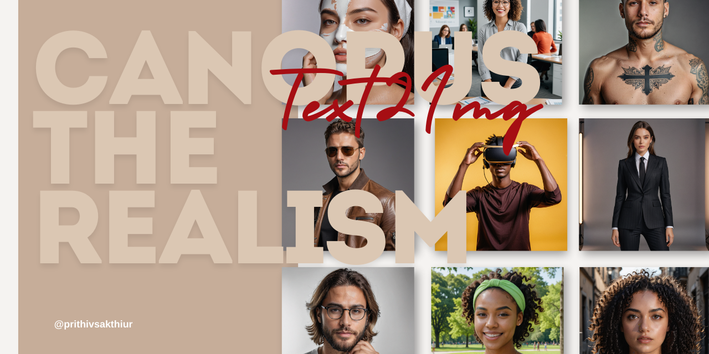
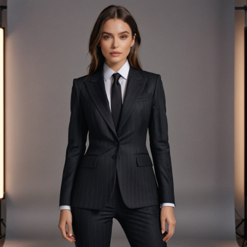
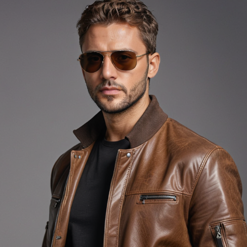
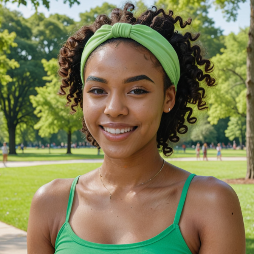
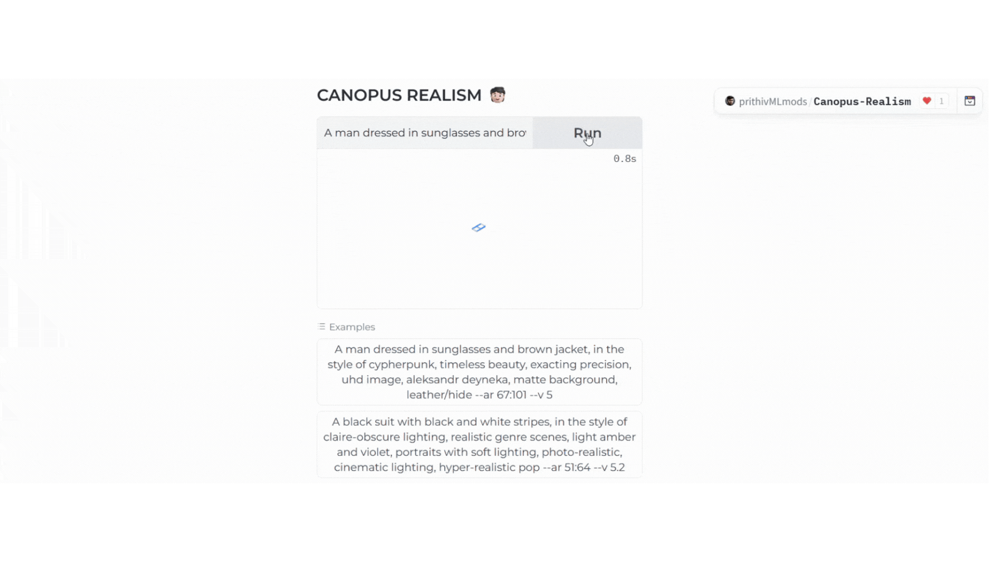
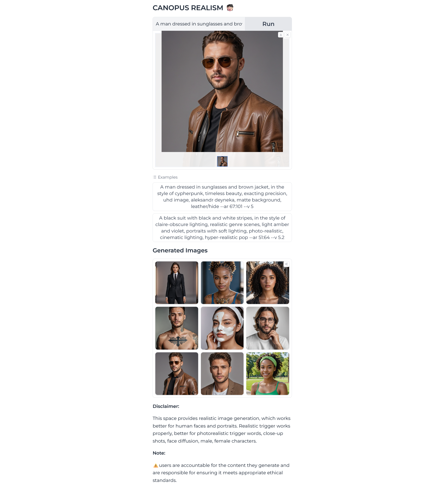
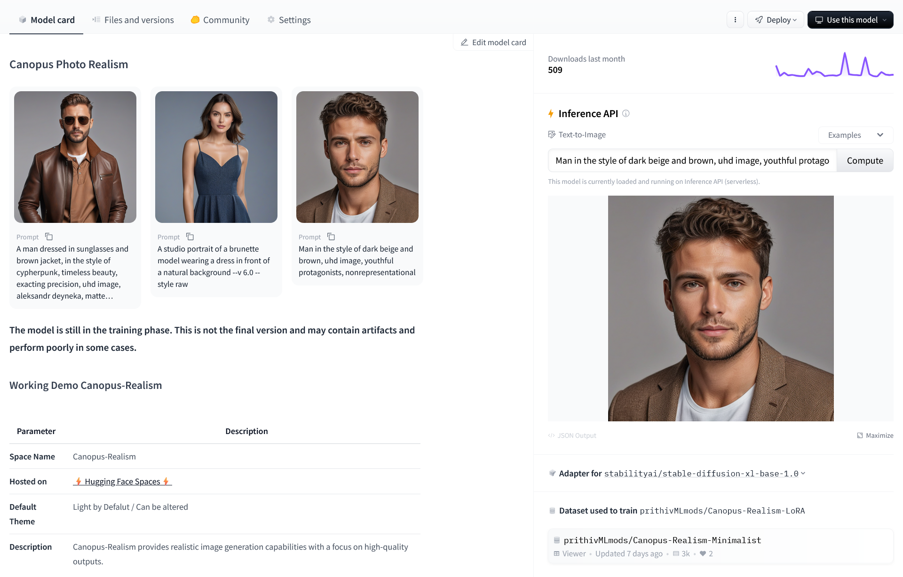

## ⭐⭐⭐  Model Repository : https://huggingface.co/prithivMLmods/Canopus-Realism-LoRA  ⭐⭐⭐

Check out the configuration reference at https://huggingface.co/docs/hub/spaces-config-reference

Spaces: https://huggingface.co/spaces/prithivMLmods/Canopus-Realism

Clone by : 

    # Make sure you have git-lfs installed (https://git-lfs.com)
    git lfs install
    
    git clone https://huggingface.co/spaces/prithivMLmods/Canopus-Realism
    
    # If you want to clone without large files - just their pointers
    
    GIT_LFS_SKIP_SMUDGE=1 git clone https://huggingface.co/spaces/prithivMLmods/Canopus-Realism

## 🧒🏻Demo Images : 

|  |  |
|-------------------------|-------------------------|
|  |  |

## Working Demo

## Screenshots

## Requirements.txt

| torch     | diffusers | transformers | safetensors |
|-----------|-----------|--------------|-------------|
| accelerate| spaces    | peft         | pillow      |

## Model Dx

---

# Canopus-Realism-LoRA

The LoRA for the Realism model was trained based on Stable Diffusion XL, working paired with the RealVisXL_V4.0_Lightning model to obtain better diffusion and enhanced results.

| Parameter           | Description                                          |
|---------------------|------------------------------------------------------|
| **Space Name**      | Canopus-Realism                                      |
| **Model Repo**       | [⚡Datasets Used⚡](https://huggingface.co/datasets/prithivMLmods/Canopus-Realism-Minimalist) |
| **Default Theme**   |      Light by Defalut / Can be altered                                         |
| **Description**     | Canopus-Realism provides realistic image generation capabilities with a focus on high-quality outputs. |

## Training Parameters

| Parameter                  | Value       | Parameter                    | Value  |
|----------------------------|-------------|------------------------------|--------|
| **LR Scheduler**           | constant    | **Noise Offset**             | 0.03   |
| **Optimizer**              | AdamW       | **Multires Noise Discount**  | 0.1    |
| **Network Dim**            | 64          | **Multires Noise Iterations**| 10     |
| **Network Alpha**          | 32          | **Repeat**                   | 20     |
| **Epoch**                  | 20          | **Save Every N Epochs**      | 1      |

## Basic Parameters Passed to the Code

| Parameter                  | Value                                                                                      |
|----------------------------|--------------------------------------------------------------------------------------------|
| **Prompt**                 | Closeup of blonde woman depth of field, bokeh, shallow focus, minimalism, fujifilm xh2s with Canon EF lens, cinematic --ar 85:128 --v 6.0 --style raw |
| **Sampler**                | euler                                                                                      |

## Download Model

Weights for this model are available in Safetensors format. You can download them from the [Files & versions](https://huggingface.co/prithivMLmods/Canopus-Realism-LoRA/tree/main) tab.

---

.

.

.@prithivmlmods - hf
