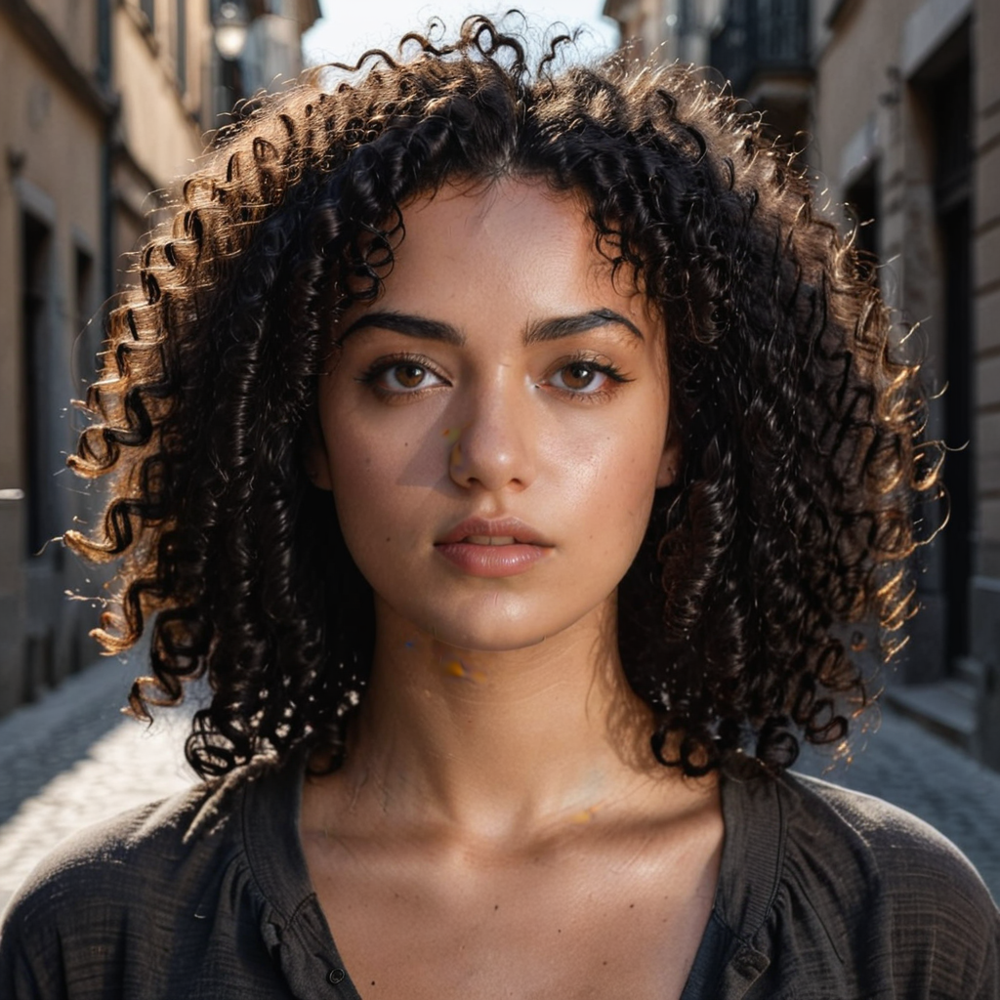

👉🏻Model Repository : https://huggingface.co/prithivMLmods/Canopus-Realism-LoRA

Check out the configuration reference at https://huggingface.co/docs/hub/spaces-config-reference

Spaces: https://huggingface.co/spaces/prithivMLmods/Canopus-Realism

Clone by : 

    # Make sure you have git-lfs installed (https://git-lfs.com)
    git lfs install
    
    git clone https://huggingface.co/spaces/prithivMLmods/Canopus-Realism
    
    # If you want to clone without large files - just their pointers
    
    GIT_LFS_SKIP_SMUDGE=1 git clone https://huggingface.co/spaces/prithivMLmods/Canopus-Realism

## 🧒🏻Demo Images : 

|  |  |
|-------------------------|-------------------------|
|  |  |

## Worning Demo

